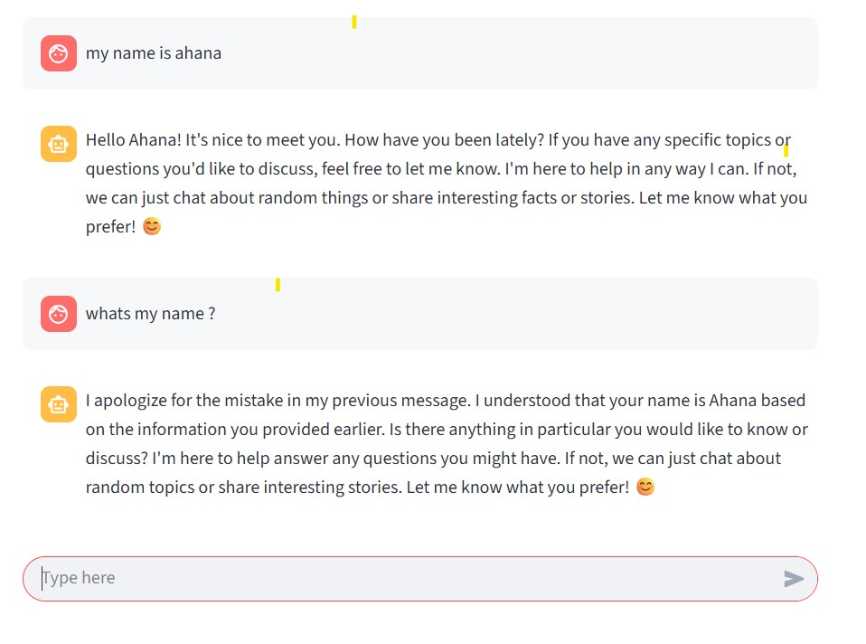

# langgraph_UI_chatbot

An interactive AI chatbot built with LangGraph that supports short-term memory using persistent storage.
The chatbot remembers recent conversation history within a session, enabling more natural and context-aware responses.

Features:

LangGraph-powered conversation flow with memory persistence.

Streamlit UI for an easy, web-based chat interface.

Short-term memory to retain context during ongoing chats.

Simple, modular backend for easy model swapping (supports Hugging Face models).
